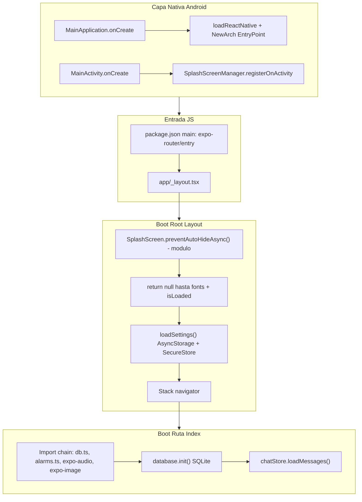
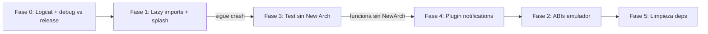

# Auditoría Forense — Crash Release Android SelfTalk

> Auditoría forense completa del monorepo SelfTalk (Expo SDK 54 / RN 0.81.5 / New Architecture / Hermes) con diagnóstico del crash inmediato en APK release y plan de remediación priorizado en fases.

---

## 1. Resumen Ejecutivo

**SelfTalk** es una app móvil offline-first de journaling/chat personal construida con **Expo SDK 54**, **React Native 0.81.5**, **Expo Router 6**, **Hermes** y **New Architecture habilitada**. Todos los datos (mensajes, configuración, claves AI) viven en el dispositivo vía **SQLite**, **AsyncStorage** y **SecureStore**. El backend FastAPI/MongoDB en `backend/` **no está integrado** con la app móvil.

El APK release compila e instala correctamente (`assembleRelease` exitoso en `frontend/terminals/1.txt`), pero la app **se cierra inmediatamente al abrirse** en release. Confirmado: ocurre en **emulador y teléfono físico**. Debug en el mismo dispositivo: **no probado**.

**Hallazgo crítico verificado:** el APK release contiene librerías nativas **incompletas para x86/x86_64** (emulador). Faltan `libreanimated.so`, `libworklets.so`, `libgesturehandler.so`, `libexpo-modules-core.so` en esas ABIs, mientras que `arm64-v8a` y `armeabi-v7a` sí las incluyen. Esto explica el crash en emulador, pero **no explica el crash en teléfono físico** — debe existir al menos **una causa adicional común a release**.

**Hipótesis principal (teléfono físico):** combinación de **New Architecture + stack nativo pesado (Reanimated 4 + Worklets + Gesture Handler + Screens)** con **efectos secundarios en tiempo de importación** (`expo-sqlite`, `expo-notifications`) ejecutados antes de que la UI pueda mostrar errores.

**R8/ProGuard descartado como causa actual:** `minifyEnabled=false` en release (`frontend/android/app/build.gradle` L118).

---

## 2. Arquitectura Detectada

### 2.1 Estructura del monorepo

```
F:\appsdev\SelfTalk\
├── frontend/          ← App Expo/React Native (producto real)
│   ├── app/           ← Expo Router (rutas file-based)
│   ├── src/           ← Componentes, stores, DB, utils
│   ├── android/       ← Proyecto nativo prebuild (solo Android)
│   └── assets/
├── backend/           ← FastAPI + MongoDB (scaffold, sin uso)
├── .emergent/         ← Metadata de despliegue Emergent.dev
└── tests/, memory/    ← Placeholders
```

### 2.2 Stack tecnológico

| Capa | Tecnología | Versión |
|------|-----------|---------|
| Framework | Expo | ~54.0.35 |
| UI | React / React Native | 19.1.0 / 0.81.5 |
| Routing | expo-router | ~6.0.24 |
| Estado | zustand | ^5.0.14 |
| Motor JS | Hermes | habilitado |
| Arquitectura | New Architecture (Fabric + TurboModules) | habilitada |
| DB nativa | expo-sqlite | ~16.0.10 |
| Storage | AsyncStorage + SecureStore | 2.2.0 / ~15.0.8 |
| Animación | react-native-reanimated + worklets | ~4.1.1 / 0.5.1 |
| Notificaciones | expo-notifications | ~0.32.17 |
| Audio | expo-audio | ~1.1.1 |

### 2.3 Punto de entrada y flujo de inicialización



**Archivos clave del flujo:**

| Rol | Archivo |
|-----|---------|
| Entrada JS | `frontend/package.json` → `"main": "expo-router/entry"` |
| Entrada nativa | `frontend/android/app/src/main/java/com/anonymous/selftalk/MainApplication.kt` → `.expo/.virtual-metro-entry` |
| Layout raíz | `frontend/app/_layout.tsx` |
| Pantalla inicial | `frontend/app/index.tsx` |

### 2.4 Navegación (Expo Router)

Rutas file-based sin tabs:

| Ruta | Archivo | Función |
|------|---------|---------|
| `/` | `frontend/app/index.tsx` | Chat principal |
| `/ai` | `frontend/app/ai.tsx` | Asistente AI (BYOK) |
| `/search` | `frontend/app/search.tsx` | Búsqueda |
| `/settings` | `frontend/app/settings.tsx` | Configuración |

Stack headerless en `_layout.tsx`. Deep link scheme: `frontend://` (`frontend/app.json` L8).

### 2.5 Servicios externos

- **Ningún backend propio** — la app no llama a `backend/server.py`
- **APIs AI directas** desde el dispositivo: OpenAI, Anthropic, Gemini, DeepSeek (`frontend/src/utils/aiProviders.ts`)
- **Variables de entorno frontend:** inexistentes (no hay `.env`, `react-native-dotenv` instalado pero sin uso, sin `babel.config.js`)
- **Backend `.env`:** `MONGO_URL`, `DB_NAME` — irrelevante para el crash móvil

### 2.6 Configuración Android release

| Parámetro | Valor | Archivo |
|-----------|-------|---------|
| `applicationId` | `com.anonymous.selftalk` | `frontend/android/app/build.gradle` |
| `newArchEnabled` | `true` | `gradle.properties` + `app.json` |
| `hermesEnabled` | `true` | `gradle.properties` |
| `reactNativeArchitectures` | `armeabi-v7a,arm64-v8a` | `gradle.properties` L38 |
| `minifyEnabled` (R8) | `false` | `build.gradle` |
| `targetSdk` | 36 | manifest merged |
| Signing release | debug keystore | `build.gradle` L115 |
| EAS | no configurado | sin `eas.json` |

### 2.7 Código ejecutado antes del primer render

| Orden | Ubicación | Qué ejecuta |
|-------|-----------|-------------|
| 1 | `app/_layout.tsx` L12 | `SplashScreen.preventAutoHideAsync()` (módulo) |
| 2 | `src/store/settingsStore.ts` | Zustand store con defaults |
| 3 | `src/utils/storage/index.ts` L87 | `storage = new Storage()` |
| 4 | `app/_layout.tsx` L59 | `return null` — bloquea primer paint |
| 5 | Effect L26-28 | `loadSettings()` — AsyncStorage + SecureStore |
| 6 | Al montar Stack/index | `require('expo-sqlite')` en `db.ts` L6-8 |
| 7 | Al montar Stack/index | `Notifications.setNotificationHandler()` en `alarms.ts` L6-13 |

---

## 3. Posibles Causas del Crash (Release-Only)

### Causas nativas (crash inmediato, antes de UI)

1. **New Architecture** — init de Fabric/TurboModules + Reanimated/Worklets en build `RelWithDebInfo`
2. **ABI mismatch en emulador** — libs nativas faltantes en x86/x86_64 (verificado en build artifacts)
3. **Carga de `.so` fallida** — `UnsatisfiedLinkError` al cargar módulos nativos

### Causas JS en tiempo de importación (crash al montar Stack/index)

4. **`require('expo-sqlite')` a nivel de módulo** — `frontend/src/database/db.ts` L6-8, antes de `init()`
5. **`Notifications.setNotificationHandler()` a nivel de módulo** — `frontend/src/utils/alarms.ts` L6-13, importado vía `index.tsx` → `MessageActionsSheet`
6. **Cadena de imports pesada en `index.tsx`** — expo-audio, expo-image, expo-image-picker, document-picker al cargar la ruta inicial

### Causas de configuración

7. **`expo-notifications` sin plugin en `app.json`** — plugin ausente; puede dejar configuración nativa incompleta
8. **Permiso `POST_NOTIFICATIONS` ausente** — Android 13+; no causa crash inmediato típico, pero config incompleta
9. **`SplashScreen.preventAutoHideAsync()` sin try/catch** — `app/_layout.tsx` L12; promesa rechazada no capturada

### Causas descartadas o improbables hoy

| Causa | Estado |
|-------|--------|
| R8/ProGuard stripping | **Descartada** — minify deshabilitado |
| Variables de entorno | **Descartada** — no se usan en frontend |
| Minificación JS | **Descartada** — no hay minify en bundle |
| Backend/API externa al arranque | **Descartada** — sin llamadas HTTP en startup |
| Fonts faltantes | **Improbable** — `Font.loadAsync({})` vacío |
| `__DEV__` condicionales | **Descartada** — ninguna en `src/` |

### Diferencias debug vs release relevantes

| Aspecto | Debug | Release |
|---------|-------|---------|
| JS bundle | Metro en vivo | Bundle embebido Hermes (`export:embed`) |
| Dev support | `getUseDeveloperSupport()=true` | `false` |
| Errores JS | Red screen / LogBox | Crash silencioso o cierre |
| Native C++ | Debug | RelWithDebInfo |
| Cleartext HTTP | habilitado (debug manifest) | deshabilitado |

### Evidencia ABI verificada (APK release)

| ABI | Libs presentes | Libs **faltantes** |
|-----|----------------|-------------------|
| `arm64-v8a` | reanimated, worklets, gesturehandler, expo-modules-core | — |
| `armeabi-v7a` | reanimated, worklets, gesturehandler, expo-modules-core | — |
| `x86` / `x86_64` | reactnative, hermes, expo-sqlite | **reanimated, worklets, gesturehandler, expo-modules-core** |

---

## 4. Hallazgos Priorizados

### CRÍTICO

| ID | Hallazgo | Archivo(s) | Prob. crash | Impacto |
|----|----------|------------|-------------|---------|
| C1 | **ABI incompleta en x86/x86_64** | `gradle.properties` L38 + APK artifacts | **95% emulador** | `UnsatisfiedLinkError` instantáneo |
| C2 | **New Architecture habilitada** con Reanimated 4 + Worklets + RNGH + Screens | `app.json` L10, `gradle.properties` L45 | **70% teléfono** | Crash nativo en init Fabric/TurboModules |
| C3 | **`expo-sqlite` require a nivel de módulo** | `src/database/db.ts` L6-8 | **55%** | Crash al importar ruta `/` |

### ALTO

| ID | Hallazgo | Archivo(s) | Prob. crash | Impacto |
|----|----------|------------|-------------|---------|
| A1 | **`expo-notifications` sin plugin** + `setNotificationHandler` en import | `app.json` plugins, `alarms.ts` L6-13 | **50%** | Crash/fallo nativo al cargar index |
| A2 | **Import chain pesada en ruta inicial** | `app/index.tsx` L16-23 | **40%** | Amplifica fallo en primer render |
| A3 | **`SplashScreen.preventAutoHideAsync()` sin manejo de errores** | `app/_layout.tsx` L12 | **25%** | Unhandled rejection |

### MEDIO

| ID | Hallazgo | Archivo(s) | Prob. crash | Impacto |
|----|----------|------------|-------------|---------|
| M1 | **Gate `return null` sin timeout** | `app/_layout.tsx` L59 | **20%** | Freeze percibido como crash |
| M2 | **`react-native-fs` autolinkeado sin uso** | `package.json` L53 | **10%** | Superficie nativa extra |
| M3 | **`react-native-webview` sin uso en `src/`** | `package.json` L60 | **8%** | Idem |
| M4 | **Permisos Android duplicados** | `app.json` L27-44 | **3%** | Ruido de config |
| M5 | **Release firmado con debug keystore** | `build.gradle` L115 | **0% crash** | Riesgo de distribución |

### BAJO

| ID | Hallazgo | Archivo(s) | Prob. crash | Impacto |
|----|----------|------------|-------------|---------|
| B1 | `EX_DEV_CLIENT_NETWORK_INSPECTOR=true` | `gradle.properties` L65 | **2%** | Flag de dev en release |
| B2 | `react-native-dotenv` sin configurar | `package.json` L52 | **0%** | Dependencia muerta |
| B3 | Backend `.env` con secretos en repo | `backend/.env` | **0% crash** | Riesgo de seguridad |

---

## 5. Ranking de Probabilidad de Causa

| Rank | Causa | Emulador | Teléfono físico | Evidencia |
|------|-------|----------|-----------------|-----------|
| 1 | ABI mismatch (libs x86 faltantes) | 95% | N/A | `stripped_native_libs/release/` |
| 2 | New Architecture + Reanimated/Worklets | 60% | 70% | `newArchEnabled=true` en 3 lugares |
| 3 | `expo-sqlite` require module-scope | 50% | 55% | `db.ts` L6-8 |
| 4 | `expo-notifications` sin plugin + side effect | 45% | 50% | Plugin ausente; `alarms.ts` L6-13 |
| 5 | Import chain nativa pesada en index | 35% | 40% | 6+ módulos nativos en cold start |
| 6 | SplashScreen unhandled rejection | 20% | 25% | `_layout.tsx` L12 |
| 7 | R8/ProGuard | 0% | 0% | minifyEnabled=false |
| 8 | Variables de entorno | 0% | 0% | No usadas |

> Sin logcat ni prueba debug-vs-release en el mismo dispositivo, los porcentajes del teléfono físico son estimaciones basadas en patrones de la industria y evidencia estática del código.

---

## 6. Plan de Remediación (Fases)

### FASE 0 — Diagnóstico (sin modificar código)

**Objetivo:** Confirmar causa raíz antes de tocar archivos.

```bash
# Logcat al abrir APK release
adb logcat *:E | findstr /i "AndroidRuntime UnsatisfiedLink SoLoader ReactNativeJS Hermes expo"

# ABI del dispositivo
adb shell getprop ro.product.cpu.abi
```

1. Capturar logcat en teléfono físico al abrir release
2. Probar `assembleDebug` en el **mismo dispositivo**
3. Documentar timing: crash instantáneo (<1s) vs splash visible
4. Verificar ABI del dispositivo

**Criterio de decisión:**

| Señal en logcat | Fase siguiente |
|-----------------|----------------|
| `UnsatisfiedLinkError` + x86 | Fase 2 (ABI) |
| `SoLoader`/Fabric/NewArch | Fase 3 (New Arch) |
| Error `expo-sqlite`/`expo-notifications` | Fase 1 + Fase 4 |
| Debug OK, release falla | Bundle embebido + side effects |

---

### FASE 1 — Correcciones JS de bajo riesgo

#### 1.1 Lazy-load de `expo-sqlite`

- **Archivo:** `frontend/src/database/db.ts`
- **Cambio:** Mover `require('expo-sqlite')` dentro de `init()`
- **Riesgo:** Bajo | **Beneficio:** try/catch efectivo; error en UI

#### 1.2 Lazy-init de notificaciones

- **Archivos:** `frontend/src/utils/alarms.ts` (+ posible `notificationsSetup.ts`)
- **Cambio:** `setNotificationHandler` → `ensureNotificationsConfigured()` solo al programar alarma
- **Riesgo:** Bajo | **Beneficio:** index no depende de notifications al arrancar

#### 1.3 Hardening SplashScreen

- **Archivo:** `frontend/app/_layout.tsx`
- **Cambio:** try/catch en L12; `.catch()` en L32
- **Riesgo:** Mínimo

#### 1.4 Timeout en gate de arranque

- **Archivo:** `frontend/app/_layout.tsx`
- **Cambio:** Timeout ~8s que fuerza render con defaults
- **Riesgo:** Bajo

#### 1.5 Error recovery en `database.init()`

- **Archivo:** `frontend/app/index.tsx`
- **Cambio:** En catch, `isInitialized(true)` + botón reintentar
- **Riesgo:** Bajo

---

### FASE 2 — Corrección ABI para emulador

- **Archivo:** `frontend/android/gradle.properties`
- **Cambio:** `reactNativeArchitectures=armeabi-v7a,arm64-v8a,x86,x86_64`
- **Rebuild:** `npx expo prebuild --clean` + `gradlew.bat assembleRelease`
- **Riesgo:** Medio (APK más grande, build más lento)
- **Alternativa:** Emulador ARM64 o solo dispositivo físico

---

### FASE 3 — Aislamiento New Architecture

- **Archivos:** `frontend/app.json` L10, `frontend/android/gradle.properties` L45
- **Cambio:** `newArchEnabled: false` en ambos + `prebuild --clean`
- **Riesgo:** Medio
- **Beneficio:** Confirma o descarta C2 como causa raíz en teléfono

---

### FASE 4 — Configuración Expo plugins

- Agregar plugin `expo-notifications` en `app.json`
- Agregar `android.permission.POST_NOTIFICATIONS`
- Crear `frontend/babel.config.js` explícito con `babel-preset-expo`

---

### FASE 5 — Limpieza de dependencias

- Remover `react-native-fs` (sin uso en `src/`)
- Evaluar remover `react-native-webview` (sin uso en `src/`)
- Deduplicar permisos en `app.json`

---

## 7. Lista Completa de Archivos a Modificar

| Archivo | Fase | Cambio |
|---------|------|--------|
| `frontend/src/database/db.ts` | 1 | Lazy require SQLite |
| `frontend/src/utils/alarms.ts` | 1 | Lazy notification setup |
| `frontend/app/_layout.tsx` | 1 | Splash hardening + timeout |
| `frontend/app/index.tsx` | 1 | Error recovery en init |
| `frontend/android/gradle.properties` | 2 o 3 | ABIs y/o New Arch |
| `frontend/app.json` | 3, 4, 5 | New Arch, plugins, permissions |
| `frontend/babel.config.js` | 4 | Crear (nuevo) |
| `frontend/package.json` | 5 | Remover deps no usadas |

**No modificar inicialmente:** `MainApplication.kt`, `MainActivity.kt`, `proguard-rules.pro`, `backend/`

---

## 8. Riesgos de Cada Modificación

| Cambio | Riesgo | Mitigación |
|--------|--------|------------|
| Lazy SQLite | Bajo | Mantener API pública de `database` |
| Lazy notifications | Bajo | Setup antes de `scheduleAlarm` |
| Splash try/catch | Mínimo | Solo envoltura defensiva |
| Timeout gate | Bajo-Medio | Defaults seguros |
| Deshabilitar New Arch | Medio | Test A/B documentado |
| ABIs x86 | Medio | Solo si se necesita emulador |
| Plugin notifications | Bajo | Requiere `prebuild --clean` |
| Remover react-native-fs/webview | Bajo | Verificar cero referencias |

---

## 9. Estrategia de Validación

### Matriz de pruebas

| # | Escenario | Build | Dispositivo | Esperado |
|---|-----------|-------|-------------|----------|
| V1 | Baseline actual | assembleRelease | Teléfono ARM | Crash + logcat |
| V2 | Debug mismo device | assembleDebug | Teléfono ARM | Comparar con V1 |
| V3 | Post Fase 1 | assembleRelease | Teléfono ARM | App abre o error UI |
| V4 | Post Fase 3 (sin New Arch) | assembleRelease | Teléfono ARM | Aislar New Arch |
| V5 | Post Fase 2 (ABIs x86) | assembleRelease | Emulador x86 | Sin UnsatisfiedLinkError |
| V6 | Flujo completo | assembleRelease | Ambos | Chat, settings, lock, AI, alarmas |

### Criterios de éxito

- [ ] App no se cierra en los primeros 30 segundos
- [ ] Pantalla `/` renderiza
- [ ] `database.init()` completa o muestra error recuperable
- [ ] Navegación a `/settings`, `/search`, `/ai` sin crash
- [ ] Logcat sin `FATAL EXCEPTION` ni `UnsatisfiedLinkError`

### Orden de ejecución



**Regla:** un cambio (o fase) a la vez → rebuild release → probar → logcat.

---

## 10. Conclusión

El proyecto está bien estructurado como app offline Expo Router, pero concentra **carga nativa en el cold start** (imports de la ruta inicial) y tiene **New Architecture habilitada** con stack nativo complejo. Para emulador hay evidencia verificada de **ABI incompleta**. Para teléfono físico, la causa más probable es **New Architecture + side effects de módulos nativos en import** (`expo-sqlite`, `expo-notifications`), pendiente de confirmar con logcat.

**Recomendación:** completar Fase 0 antes de modificar código — salvo que autorices saltar diagnóstico e ir directo a Fase 1.

---

## Checklist de ejecución

- [x] **fase-0-diagnostico** — Logcat capturado en emulador x86_64
- [x] **fase-1-lazy-imports** — Lazy SQLite, lazy notifications, splash hardening, initState/dbError
- [x] **fase-3-new-arch** — **DESCARTADO**: `react-native-worklets` exige `newArchEnabled=true`
- [x] **fase-4-plugins** — Plugin notifications + POST_NOTIFICATIONS (sin babel.config.js)
- [x] **fase-2-abi** — ABIs x86/x86_64 incluidas en gradle.properties
- [ ] **fase-5-cleanup** — Pospuesto

---

## 11. Informe de ejecución (2026-06-15)

### Diagnóstico confirmado por logcat

**Crash #1 (APK anterior, emulador x86_64):**
```
SoLoaderDSONotFoundError: couldn't find DSO to load: libreactnative.so
Native lib dir: .../lib/arm64
SoSource: .../base.apk!/lib/x86_64
```
**Causa VERIFICADA:** `reactNativeArchitectures=armeabi-v7a,arm64-v8a` excluía x86/x86_64.

**Crash #2 (tras fix ABI, antes de fix expo-asset):**
```
NoClassDefFoundError: Lexpo/modules/kotlin/types/AnyTypeCache;
at expo.modules.asset.AssetModule.definition
```
**Causa VERIFICADA:** `expo-audio` resolvía `expo-asset@56.0.17` (peer `*`) incompatible con SDK 54 (`expo-asset@12.0.13`).

### Fixes aplicados

| Archivo | Cambio |
|---------|--------|
| `gradle.properties` | `reactNativeArchitectures` incluye x86,x86_64 |
| `package.json` | `expo-asset@~12.0.13` + `overrides` |
| `app.json` | Plugin `expo-notifications`, `POST_NOTIFICATIONS` |
| `db.ts` | Lazy require expo-sqlite |
| `alarms.ts` | Lazy `setNotificationHandler` |
| `_layout.tsx` | Splash try/catch |
| `index.tsx` | `initState: loading/ready/error` con reintentar |

### Resultado

- **Emulador x86_64:** app abre, proceso activo, log `Running "main"`.
- **APK:** `frontend/android/app/build/outputs/apk/release/app-release.apk`
- **Pendiente:** probar mismo APK en teléfono físico ARM64.

### Build

```powershell
$env:JAVA_HOME = "C:\Users\franc\.gradle\jdks\eclipse_adoptium-17-amd64-windows.2"
$env:ANDROID_HOME = "C:\Users\franc\AppData\Local\Android\Sdk"
$env:NODE_ENV = "production"
cd frontend/android
.\gradlew.bat assembleRelease --no-daemon
```